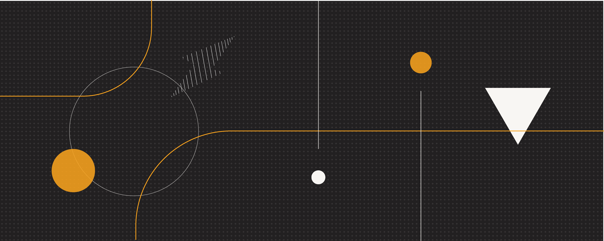

# ⚡Welcome⚡

## Featured Articles



* [Bootstrapping Lightning Channels](tutorials/troubleshooting/bootstrapping-channels.md)
* [Lightning with Tor](tutorials/nodes/tor.md)
* [Understanding Lightning Invoices](lightning-technology/lightning/invoice.md)
* [LND \(Lightning Network Daemon\)](tutorials/nodes/lnd.md)



* [Bitcoin Testnet Lightning Network](tutorials/apps/bitcoin-testnet-ln.md)
* [Litecoin Lightning Network](tutorials/apps/litecoin-ln.md)
* [Spacebit Satellite Client](tutorials/apps/spacebit-satellite-client.md)
* [Lightning Torch](tutorials/apps/lightning-torch.md)
* [Lightning Tipping Sites](tutorials/apps/tipping-sites.md)



* [Atomic Multi-Path Payments \(AMP\)](lightning-technology/research/atomic-multi-path-payments.md)
* [Lightning Hardware Appliances](lightning-technology/research/lightning-appliance.md)
* [Watchtower Services](lightning-technology/research/watchtowers.md)
* [Trustless Layer1-Layer2 \(Submarine\) Swaps](lightning-technology/research/submarine-swap.md)
* [Macaroons for LND Authentication](lightning-technology/research/macaroons.md)
* [Channel Backup](lightning-technology/channels/channel-backups.md)



## Welcome to the ION Wiki!

The Lightning Network is here, and it's delivering **fast, free, and final Bitcoin payments**.

The number of nodes—and the amount of bitcoin—are increasing daily, and developers are creating new applications to experiment with the network and explore its possibilities.

But as the resources for building with Lightning proliferate, they are spread across numerous GitHub repositories, Subreddits, Slack and Telegram chats, and Medium articles.

ION wiki is a tool for **collecting the best Lightning tutorials, references, tools, and apps** in one place.

## [Contributing](wiki-basics/contributing.md) 

Know something about Lightning? **Share your know-how** and accelerate the rate of LN development.

#### [**This wiki lives in GitHub**](wiki-basics/content-license.md) and is Creative Commons licensed! It's your Lightning lab notebook—it's not locked in someone else's database.

Check out the [**top contributors on GitHub**](https://github.com/RadarTech/ionwiki/graphs/contributors) and join the discussion [**on Telegram**](https://t.me/radarion).

