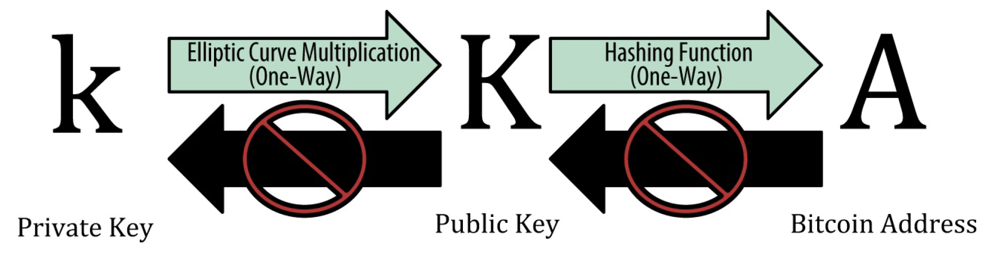

# Hash

## Overview

A hash algorithm turns an arbitrary amount of data into a fixed-length **hash**. A hash is a fingerprint of the input data, and the same hash will always result from the same data. A hash algorithm is designed to be a one-way function.

## Details

### Bitcoin Hashes

Cryptographic hash functions are used extensively in bitcoin: in bitcoin addresses, in script addresses, and in the mining Proof-of-Work algorithm. Bitcoin uses the SHA-256 algorithm to generate hashes. 

### Private and Public Keys

In private and public key cryptography, a one-way cryptographic hash function is used to generate a bitcoin address. 

## Resources

[SHA-256 Hash Generator](https://www.movable-type.co.uk/scripts/sha256.html)

## References

\[1\] 

