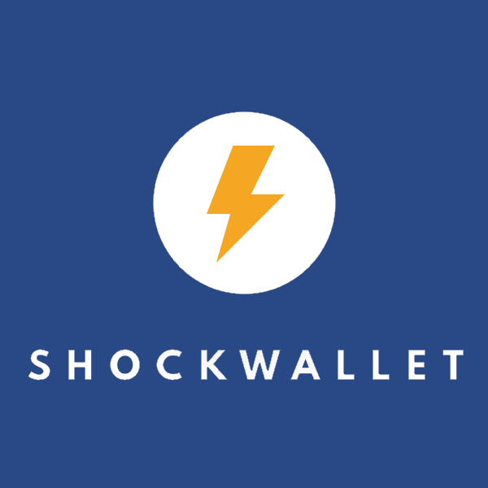

# Bolt Action

  
**What inspired you to build Bolt Action?**  
  
I got inspired to start building on Lightning after experimenting with it early on, it seemed obvious to me that it will eventually be integrated into our lives like most other web protocols. The internet of money has found its HTTPS in my opinion.  
  
**In three sentences or less, tell us about your project.**  
  
Bolt Action was intended to be a concept demo showing how a lightning node could seamlessly fit into a social network. The name is a pun, Bolt of course for lightning, Bolt Action inferring a GUN. GUN is a decentralized database I'm using to build a social layer for lightning.  
  
**How did you build Bolt Action?**  
  
I ended up only having a few hours to devote to the hackathon, so I scratched out an agent in NodeJS and a view in React.   
  
**What are your plans for the project post hackathon?**  
  
I'm ultimately working on ShockWallet, which will integrate GUN and a number of social/commerce features it enables in a decentralized and trust-less way. \([http://shock.network](http://shock.network/)\)  
  
**What daemon features are you most excited about?**  
  
Atomic Multipath Payments, I think that will have a really large impact on UX that enables increased adoption.   
  
 **What projects are you most excited about this next year?**  
  
The progress on the chain and lightning daemons aside, there are some potentially disruptive applications out there centered around lightning, such as SuredBits using it for monetizing API calls, to Koala Studios and Donner Lab adding a whole new element to the gaming scene. ShockWallet should be pretty cool too :\)

