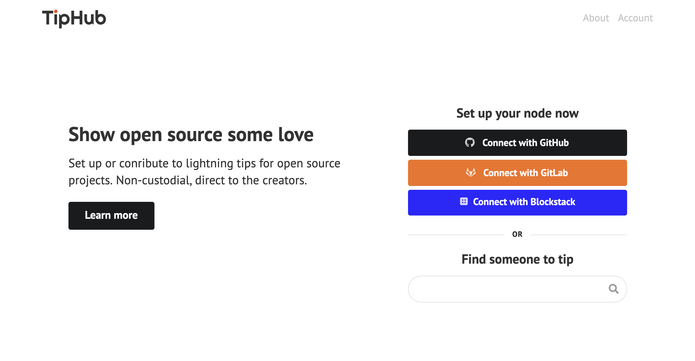
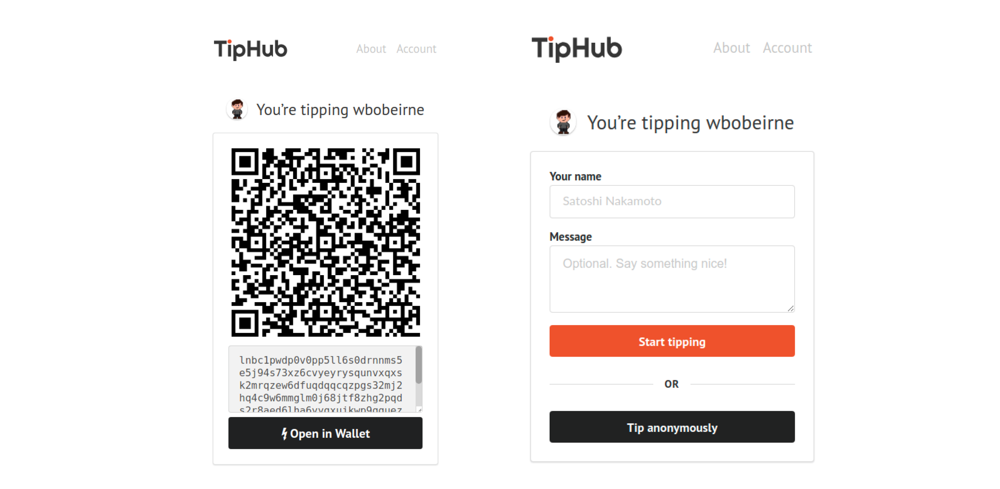
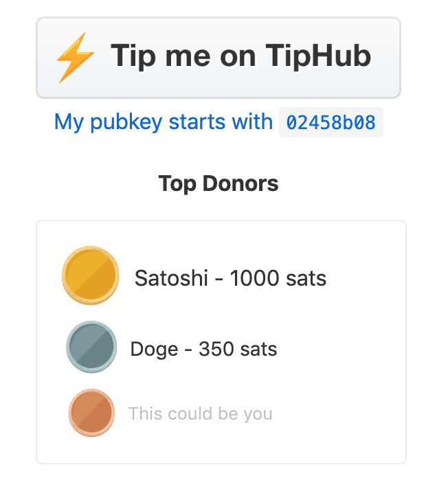

# TipHub

**What inspired you and Carl to build TipHub?**

We've both been really interested in alternative funding models for open source work. Maintaining open source projects has never been a lucrative endeavor in its own right, but the value of incentivizing it can't be understated. The majority of code today is written on top of open source languages, frameworks, and operating systems, and we need to continue to encourage people to keep contributing and maintaining. While we don't expect TipHub \(or any tip-based funding\) to completely solve the problem, a little bit of money and a nice message can sometimes be enough to keep someone passionate about working on their project.   
  
**In three sentences or less, tell us about your project.**   
  
TipHub is a non-custodial tipping service for open source projects. We make it easy to setup a tip button right in your project's readme to let users and other developers show some love to your project. Unlike most other Lightning tipping services, we facilitate a direct connection to developer's nodes.  

**How did you build TipHub?**  
  
Our stack is a python backend using Flask and SQLAlchemy with a Postgres database, and a frontend written in Typescript using React and the Semantic UI component library. Carl focused on the backend and Lightning RPC layer, while I focused on the API and frontend. It's currently hosted on Heroku.  

**What were the biggest development challenges?**

Lightning developer libraries are still pretty early and sparse. The choice of Python for the backend was just something we were familiar with, but in general we found that the libraries available around Lightning, and Python and Flask's less-than-stellar handling of threading or asynchronous code made it less easy than we'd hoped. I won't speak for Carl on this, but personally I've found the Javascript \(better yet, Typescript\) tooling to be a little stronger so far, and its async-first approach to code makes working with sockets to the Lightning node and client a much better developer experience overall.  
  
**What operational challenges have you run into since launch**  
  
We haven't launched quite yet, and one of the things holding us back is making absolutely sure we handle all of the issues that can occur with accounting for tipping. While we're safe in the fact that users can never "lose" money since it's a direct tip to the developer's node with no intermediary, we want to make sure that it all gets logged correctly \(Since we record and notify when tips are made,\) or lets them know if something has gone wrong \(e.g. if their node is offline.\)  
  
**What are your plans for the project post hackathon?**

The plan is to go live sometime in the next few weeks! As noted above, we want to be ready for everything that can go wrong with Lightning, and clean up some of our hackathon sins that made it in in the final hours. We've also got a handful of features planned such as on-chain fallback addresses for non-lightning users or those who want to make larger tips, and an embeddable leaderboard to show your project's highest tippers. Here's what that'd look like:  

**What daemon features are you most excited about?**  
  
There are too many to go over, so I'll just pick one: The macaroon "bakery." LND provides you with auth tokens that have different levels of access called macaroons. It works similarly to oauth, giving external applications limited functionality. That's how TipHub is able to generate invoices for your node, without having access to do things such as make payments from your node, keeping your funds secure. The idea of the macaroon bakery would be a programmatic way of generating these macaroons. So one cool example of how this could work in the future is that you generate a macaroon that is only allowed to send a limited number of satoshis per month. Provide that macaroon to an external service, and now they can pull a monthly subscription directly from your node, that you can revoke at any time.  
  
**What projects are you most excited about this next year?**  
  
Lightning is moving so fast, it's hard to see what's coming beyond a few weeks. But stabilizing mainnet neutrino nodes to allow for easier setup is going to make Lightning absolutely explode, so I'm excited to onboard all of those new users. Likewise, so far most of what we've seen with Lightning have been built by solo enthusiasts, so I'm looking forward to what larger teams with will be able to put together once there's a much larger audience to attract them to building on Lightning. And hopefully, more hackathons like the Boltathon!

