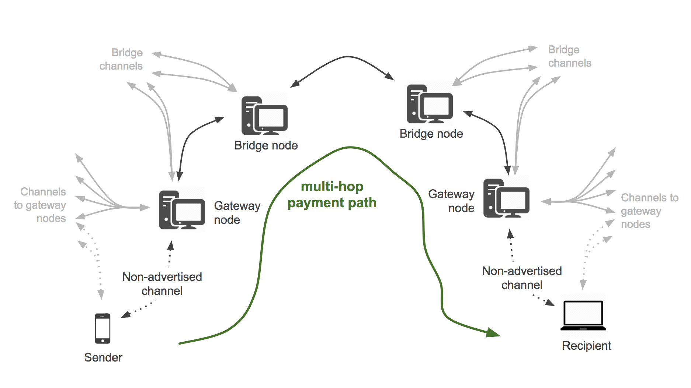

# Payment Routing

## Overview

**Payment routing** is a fundamental concept in Lightning transactions, enabling nodes that do not have explicit channels to transmit payments to one another. Using [Hashed TimeLock Contracts](../bitcoin-basics/hltc.md), payments can be securely routed between intermediate nodes.

## Details

### Multi-hop Payment Path



### Gateway Nodes

“Gateway” routing nodes are those that directly serve end users. These nodes will serve a relatively small number of users \(likely in the hundreds\) and will have modest hardware, bandwidth and capital requirements. Over time, gateway nodes will become more highly connected.

### Routing Capabilities

Through a process that’s analogous to finding connections between people in “Six Degrees of Separation,” Lightning Nodes can determine routes to any node in the network. The transaction with the generated route is then sent across that series of nodes.

### Routing Hints

Routing hints provide information to find non-advertised, or private, channels. This allows routing of payments to nodes that are not publicly visible on the network. A routing hint provides a partial route between the receiver's private node and a public node. This routing hint is then included in the invoice generated by the receiver and provided to the payer.

Routing hints require the sharing of a `node_id` and `channel_id`, where the `node_id` represents the public node and the `channel_id` represents the private channel. The `channel_id` is meaningless to the payer of the invoice but is recognizable to the public node, as it is privately connected to the node that generated the invoice. By specifying numerous routing hints in an invoice, users can increase the likelihood that a paying node can find a successful path to the receiver.

Users can view route hints using `lncli decodepayreq <invoice>.`

```text
    "route_hints": [                                           
        {
            "hop_hints": [
                {
                    "node_id": "03236a685d30096b26692dce0cf0fa7c8528bdf61dbf5363a3ef6d5c92733a3016",
                    "chan_id": "1589513382741409793",
                    "fee_base_msat": 1000,
                    "fee_proportional_millionths": 1,
                    "cltv_expiry_delta": 144
                }
            ]
        }
    ]
```

## Resources

[Lightning Developers API](https://api.lightning.community/)

## References

\[1\] [https://blog.lightning.engineering/posts/2018/05/30/routing.html](https://blog.lightning.engineering/posts/2018/05/30/routing.html)

