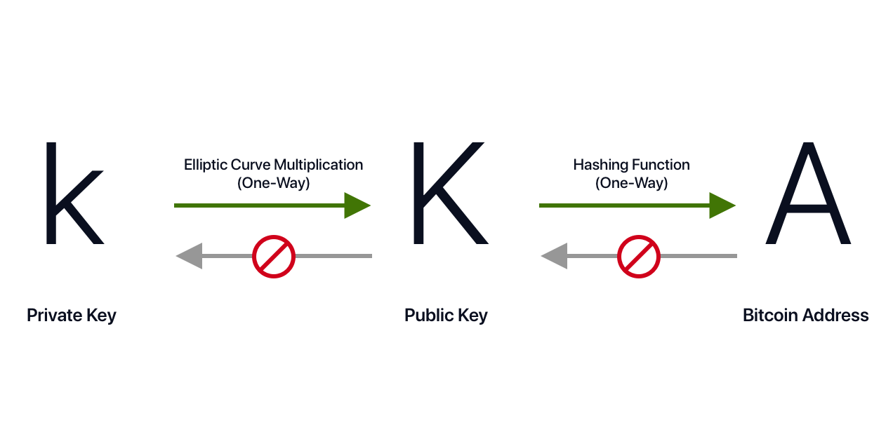

# Hash

## Overview

A hash algorithm turns an arbitrary amount of data into a unique fixed-length **hash**. A hash is a fingerprint of the input data, and the same fingerprint can always be produced from the same input data. Hashes are essential to cryptographic functions not only on Bitcoin but also on the Lightning Network.

## Details

### Bitcoin Hashes

Cryptographic hash functions are used extensively in Bitcoin: in bitcoin addresses, in script addresses, and in the mining Proof-of-Work algorithm. Bitcoin uses the SHA-256 algorithm to generate hashes.

### Private and Public Keys

Public-key cryptography involves a key pair: a _public key_ and a _private key_. Each entity has their own. The public key can be shared around, the private key is secret.

They allow doing two things:

* _Encrypt_ a message with the public key, _decrypt_ it with the private key
* _Sign_ a message with the private key, _verify_ it with the public key

Some common algorithms are [RSA](https://en.wikipedia.org/wiki/RSA_%28cryptosystem%29) \(used for both\) and [ECDSA](https://en.wikipedia.org/wiki/Elliptic_Curve_Digital_Signature_Algorithm) \(only for signatures\).

In the bitcoin protocol, a one-way cryptographic hash function is used to generate a bitcoin address.

## Resources

[SHA-256 Hash Generator](https://www.movable-type.co.uk/scripts/sha256.html)

## References

\[1\] [https://en.bitcoin.it/wiki/Hash](https://en.bitcoin.it/wiki/Hash)

\[2\] [https://en.wikipedia.org/wiki/Cryptographic\_hash\_function](https://en.wikipedia.org/wiki/Cryptographic_hash_function)

