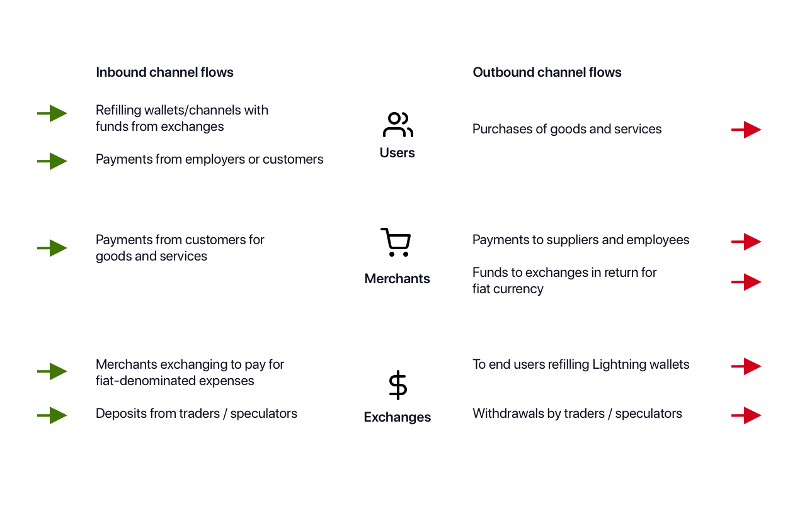
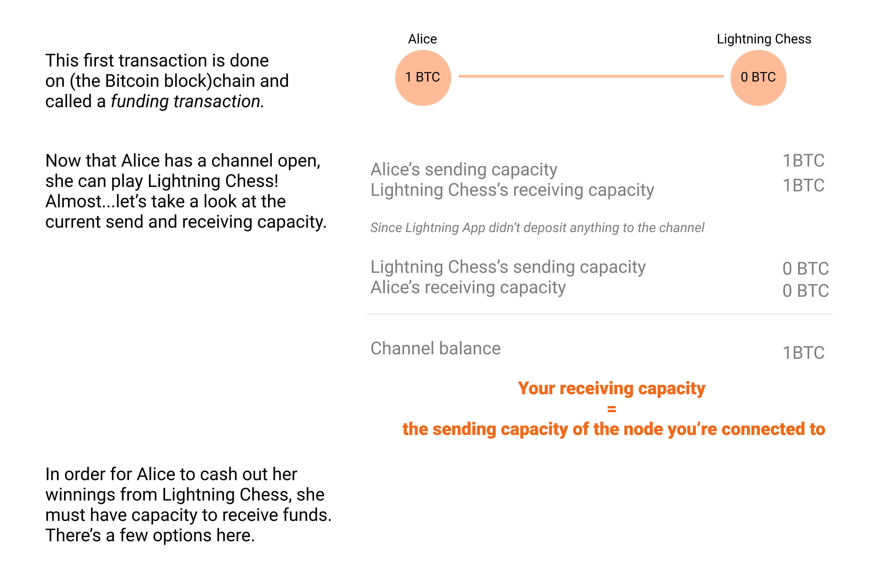

# Channel Capacity

## Overview

**Channel capacity** refers to the total balance available within a channel. The total capacity of a channel is the sum of the balance held by each participant in the channel. Channel capacity is dictated by the value of the initial on-chain funding transaction and is fixed for the life of the channel.

Channels on the Lightning Network are 'bi-directional', as both participants are able to send and receive payments. However, the ability of either participant to send or receive is defined by the balance on either side of the channel. If Alice opens a channel with Bob by making a 1BTC transaction, Alice can send up to 1BTC across the channel to Bob but is unable to receive any payments. Bob can receive up to 1BTC from Alice but is unable to send any payments. If Alice sends 0.5BTC to Bob, both participants are now able to send and receive up to 0.5BTC within the channel.

## Details

### Inbound and outbound fund flow

Funds may flow in and out of the Lightning Network for various reasons.

Option 1. Alice spends some of her channel balance with Lightning Chess and pushes funds over to them.  
Option 2. Option 2 Lightning Chess opens a channel with Alice, with funds on Lightning Chess’s side.

## References

\[1\] [https://blog.lightning.engineering/posts/2018/05/30/routing.html](https://blog.lightning.engineering/posts/2018/05/30/routing.html)

