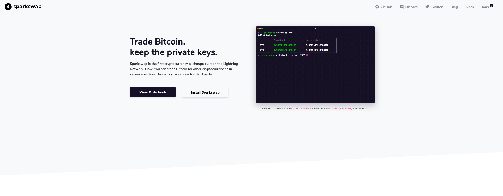

# Lightning Exchanges

Have some spare LTC and want BTC on the Lightning Network? Need to offload your altcoins to test out a new Lightning app? Need to spend some Lightning BTC so that you have [inbound liquidity](troubleshooting/bootstrapping-channels.md)? You're in luck. There are a few exchanges that enable you to exchange various tokens for BTC on Lightning.

## [FixedFloat](https://fixedfloat.com/)

FixedFloat is a Lightning compatible exchange that uses custodial swaps to exchange tokens. FixedFloat supports Bitcoin, Bitcoin \(Lightning\), Ethereum, Litecoin, Monero, 0x, Basic Attention, Binance Token, Bitcoin Cash, Bitcoin Gold, Dash, Ethereum Classic, Golem, OmiseGO, Paxos Standard, STASIS EURS, TrueUSD, and Zcash. Additionally, FixedFloat has an open [API](https://fixedfloat.com/api) that can be used with an email signup.

## [SparkSwap](https://sparkswap.com/)

SparkSwap is an exchange that offers seamless LNBTC to LTC exchanges through a CLI interface. SparkSwap facilitates exchange through atomic cross-chain swaps: trades are settled peer-to-peer, without a custodial intermediary.

## [ZigZag](https://zigzag.io/#/)

ZigZag is a Lightning exchange that relies on custodial swaps. With less support for altcoins than FixedFloat, ZigZag has open orderbooks for Ethereum, Bitcoin, Dash, and Litecoin.

## [SideShift](https://sideshift.ai/)

SideShift is a custodial exchange that provides token swaps.

SideShift is blocked in the following countries: North Korea \(DPRK\); United States; Iran, Islamic Republic of; Belarus; Burundi; Central African Republic; Cuba; Congo; Iraq; Libya; Nicaragua; Somalia; Syrian Arab Republic; Yemen; Zimbabwe; Lebanon; South Sudan; and Sudan.

## [CoinPlaza](https://www.coinplaza.it/)

Coinplaza will accept a lightning BTC payment in exchange for BTC, LTC, ETH, or a dozen other assets.

You must create an account. Does not support US customers.

## [Boltz](https://boltz.exchange/)

Boltz is an implementation of Submarine Swaps, providing a trustless, non-custodial platform for exchange. Users can exchange coins from on-chain to Lightning and vice versa without relying on an intermediary.

## [Submarine Swaps](http://submarineswaps.org/)

Need to pay an invoice? You might be interested in Submarine Swaps. [Read our article to learn more](../tech/research/submarine-swap.md) and take a look at Alex Bosworth's early [demo](http://submarineswaps.org/) of submarine swaps using fully open-source code.

