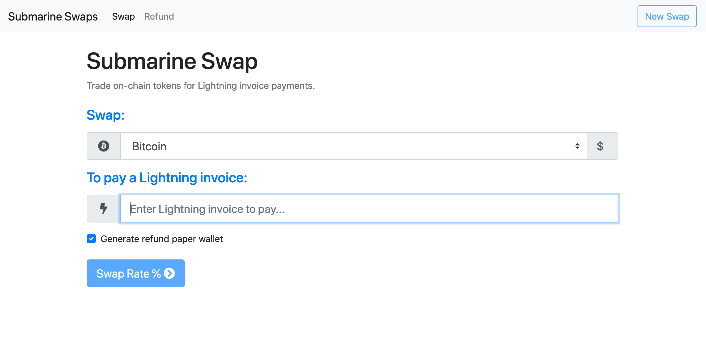
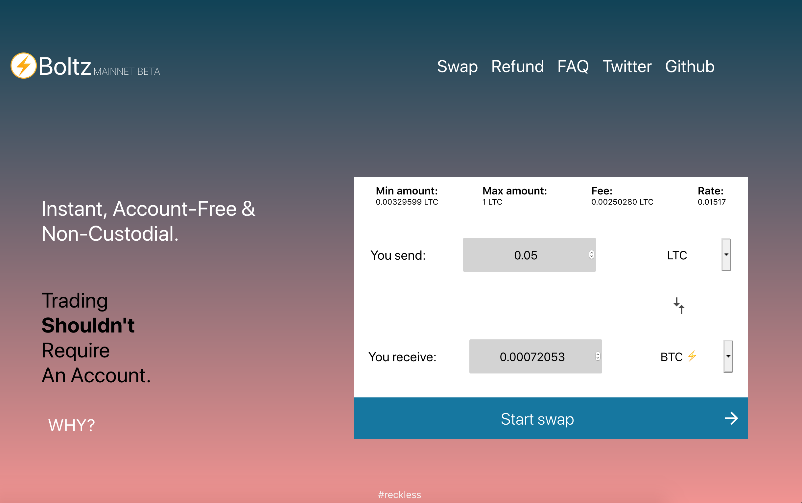
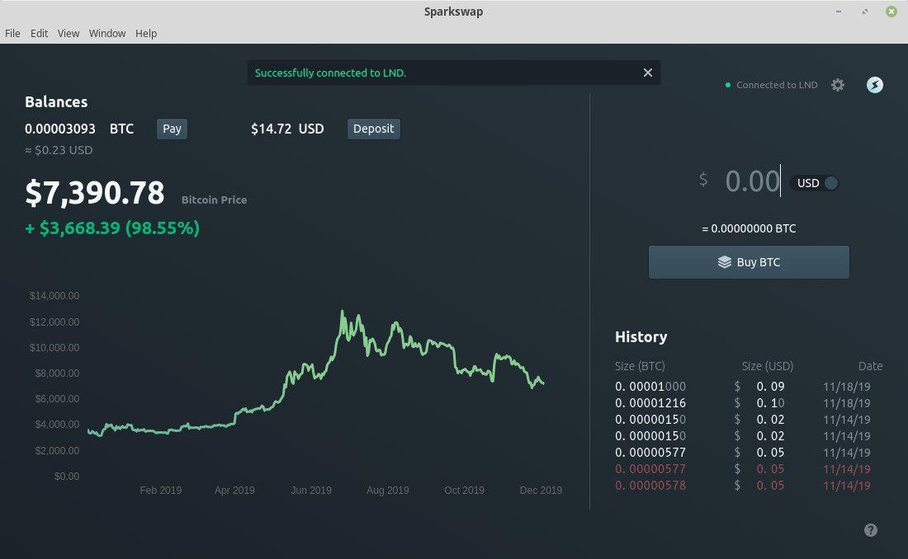
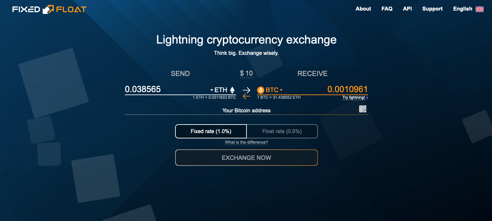
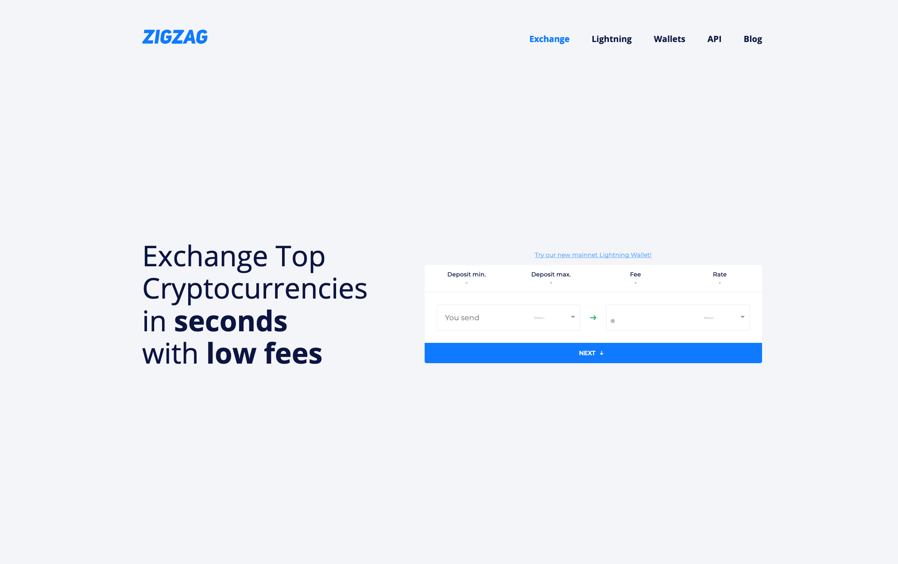
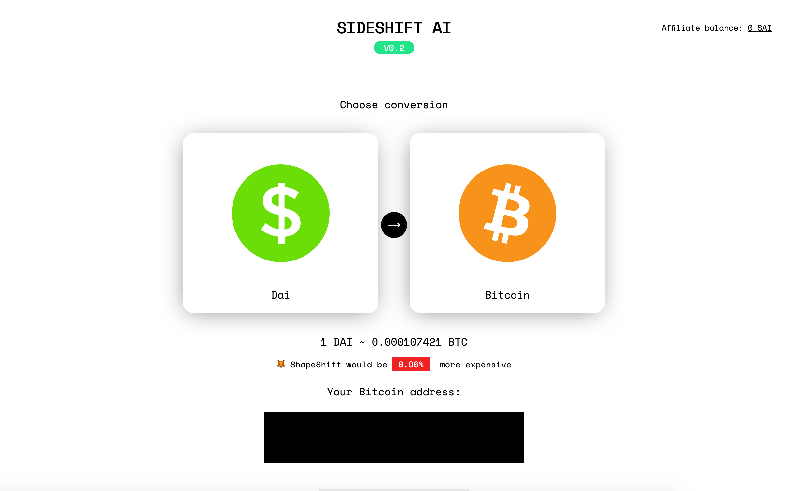
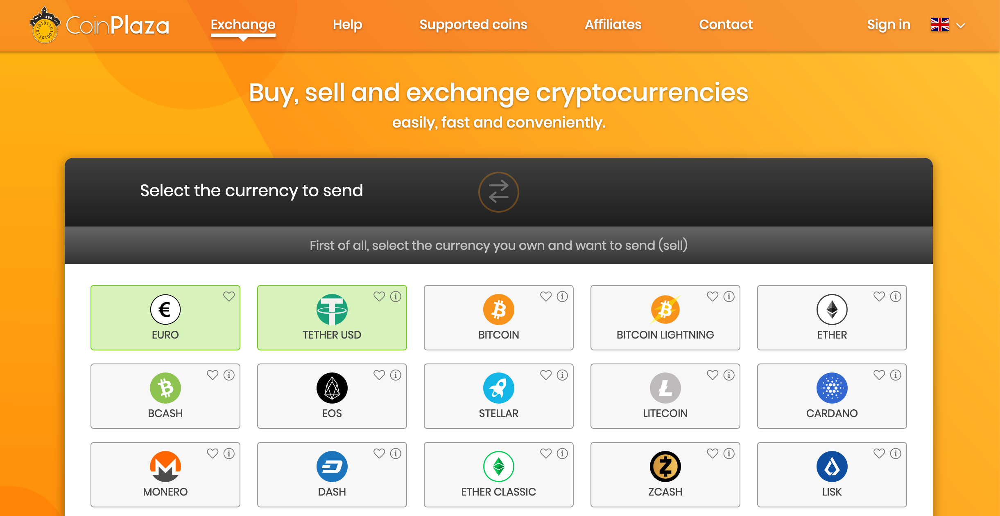

# Lightning Exchanges

Have some spare ETH or LTC and want BTC on the Lightning Network? Need to offload your altcoins to test out a new Lightning app? Need to spend some Lightning BTC so that you have [inbound liquidity](bootstrapping-liquidity.md)? You're in luck. There are a few exchanges that enable you to exchange various tokens for BTC on Lightning.

## Trustless Noncustodial Exchanges

These exchanges support noncustodial peer-to-peer trading without accounts, custodial deposits, or a trusted third-party.  They employ mechanisms that ensure trades are atomic: either both sides happen, or neither side happens.  This can be implemented with techniques like the "[submarine swap](../tech/research/submarine-swap.md)" \(atomic swap between a blockchain and the Lightning Network\) that use blockchain-based HTLC escrow to guarantee that the user can refund their payment for the trade if something goes wrong.

### [RADAR REDSHIFT](https://redshift.radar.tech/)

This service uses submarine swaps to allow you to pay a Lightning invoice with on-chain BTC or ETH.  Supports the Metamask wallet browser extension for Ethereum, so ETH can be stored within the extension or in a Ledger hardware wallet.

### [submarineswaps.org](https://submarineswaps.org)

This service uses submarine swaps to allow you to pay a Lightning invoice with on-chain BTC or LTC.  The code is [open source](https://github.com/submarineswaps/).

### [Boltz](https://boltz.exchange/)

Boltz is an implementation of submarine swaps, providing a trustless, non-custodial platform for exchange.  Supports swaps between BTC and LTC.

### [SparkSwap](https://sparkswap.com/)

SparkSwap is a desktop exchange application that allows you to purchase LN-BTC with your bank account.  It plugs into your bank account and your own Lightning node, and it's powered by an escrow system utilizing AnchorUSD on the backend.  It requires account signup and extensive KYC.

Formerly, Sparkswap supported Lightning BTC to LTC exchange through a CLI interface.

## Trusted \(Non-Atomic\) Exchange

These services also support swaps between bitcoin on the Lightning Network and other assets.  They are NOT trustless—though unlikely, it would be possible for the service to take your money and fail to deliver the assets you paid for.  Some of these services do not require an account or a deposit like a traditional exchange, but all require you to trust a third party.

### [FixedFloat](https://fixedfloat.com/)

FixedFloat is a Lightning compatible exchange that uses custodial swaps to exchange tokens. FixedFloat supports Bitcoin, Bitcoin \(Lightning\), Ethereum, Litecoin, Monero, 0x, Basic Attention, Binance Token, Bitcoin Cash, Bitcoin Gold, Dash, Ethereum Classic, Golem, OmiseGO, Paxos Standard, STASIS EURS, TrueUSD, and Zcash. Additionally, FixedFloat has an open [API](https://fixedfloat.com/api) that can be used with an email signup.

### [ZigZag](https://zigzag.io/#/)

ZigZag is a Lightning exchange that relies on custodial swaps. With less support for altcoins than FixedFloat, ZigZag has swaps available for Ethereum, Bitcoin, Dash, and Litecoin.

### [SideShift](https://sideshift.ai/)

SideShift is a custodial exchange that provides token swaps.

SideShift is blocked in the following countries: North Korea \(DPRK\); United States; Iran, Islamic Republic of; Belarus; Burundi; Central African Republic; Cuba; Congo; Iraq; Libya; Nicaragua; Somalia; Syrian Arab Republic; Yemen; Zimbabwe; Lebanon; South Sudan; and Sudan.

### [CoinPlaza](https://www.coinplaza.it/)

Coinplaza will accept a lightning BTC payment in exchange for BTC, LTC, ETH, or a dozen other assets.

You must create an account. Does not support US customers.  Successfully tested on 2019-02-10.

### [Lightning Conductor](https://lightningconductor.net/invoice)

Convert between LN-BTC and BTC without an account.  

Pay an LN invoice to receive a BTC payment on-chain, minus transaction fees and a 4,000 satoshi charge. This is useful to instantly convert some of your existing sending capacity into receiving capacity.

Successfully tested on 2019-02-10.

### [LN Zone](https://ln.zone/)

Another service that offers to send you on-chain BTC in exchange for paying a Lightning invoice, thereby converting some of your existing sending capacity into receiving capacity.

We are not sure who is operating this service and we have not tested it.

