# BTCPay Server + AWS EC2

## Overview

This guide will explain how to set up [BTCPay](https://btcpayserver.org/) on an [AWS](https://aws.amazon.com/) EC2 instance. BTCPay Server is a self-hosted, open-source cryptocurrency payment processor with lightning integration. Host your lightning wallet on the cloud to access your wallet from anywhere. BTCPay Server lets you connect to different wallets such as zap, spark and joule. It also has [Lapp](https://blockstream.com/2018/01/16/lightning-charge/) and [WordPress](https://wordpress.org/plugins/btcpay-for-woocommerce/) integration to host your own blog and lightning store!

This guide is split into three sections:

* Set up AWS EC2
* Set up DNS
* Install BTCPay Server

## Items/Cost

To comfortably run mainnet:

| Items | Cost |
| :--- | :--- |
| BTCPay Server | Free |
| AWS | ≈ $35/month |
| DNS | ≈ $15/year |
| Setup Time | 1-2 hours |
| Sync Time | 1-2 days |

An AWS EC2 instance is in the cloud so are also[ other ways](https://github.com/btcpayserver/btcpayserver-doc/blob/master/Deployment.md) to install BTCPay Server. Depending on your needs \(testnet vs mainnet\), the EC2 instance can be scaled down to save some money. There are also other DNS services to choose from such as [namecheap](https://www.namecheap.com/) and [google domains](https://domains.google/#/).

## Set up AWS EC2

Sign into AWS and click `Services`

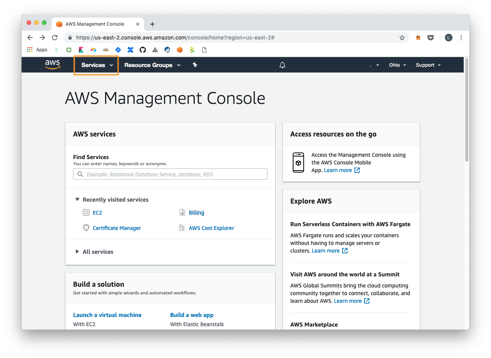

Set up an EC2 instance.

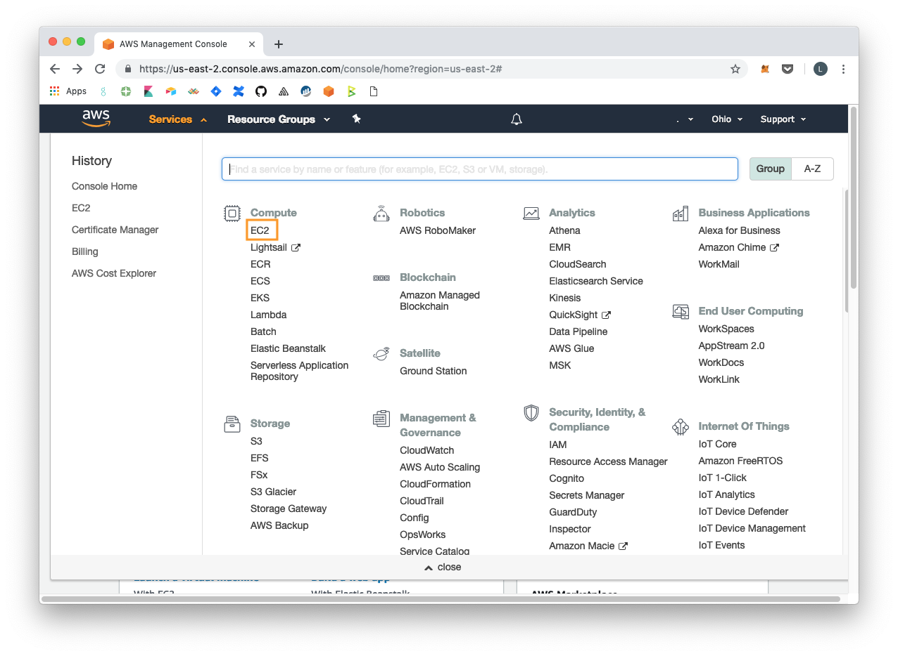

Launch a new instance.

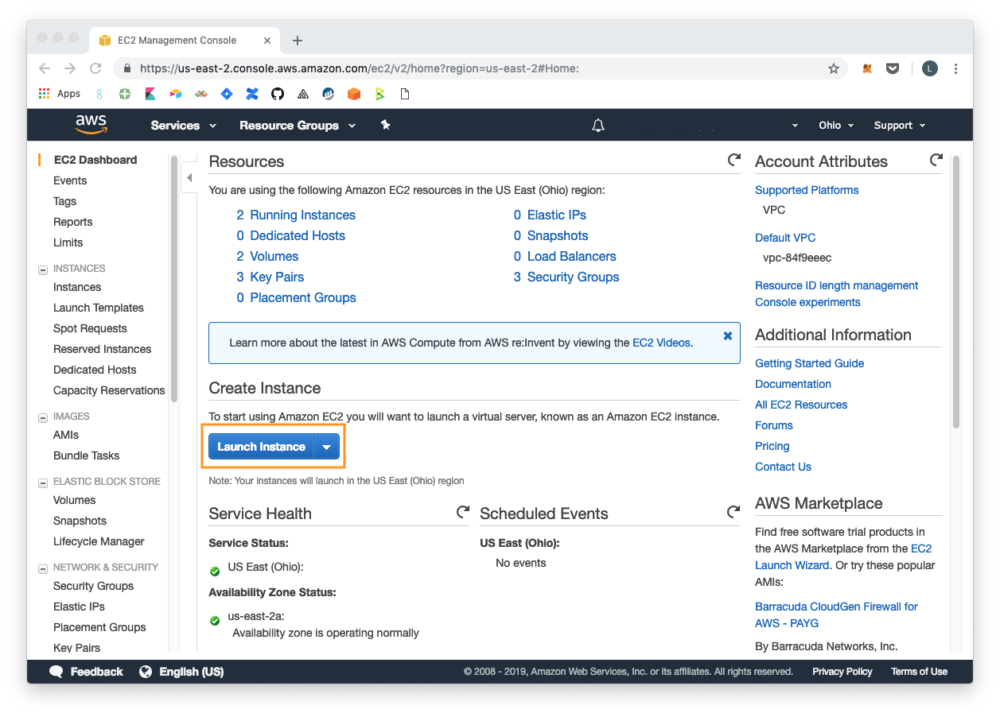

Select Ubuntu Server

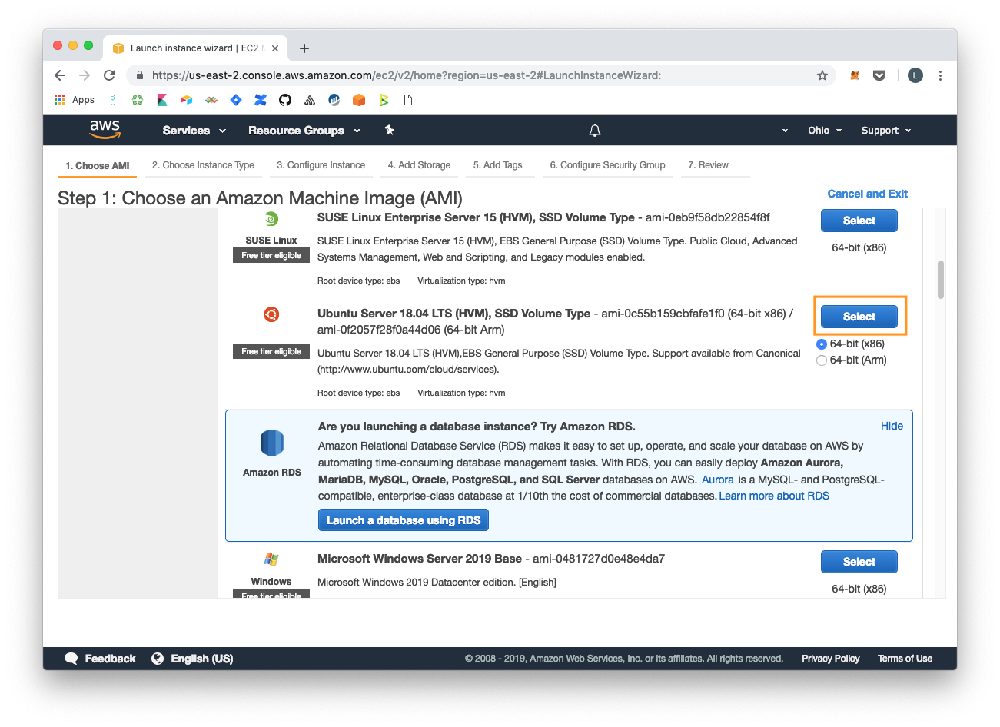

In this example, we selected instance type `t2.medium` which works well on mainnet. Feel free to experiment to get the best [₿](https://emojipedia.org/bitcoin-sign/)ang for you buck.

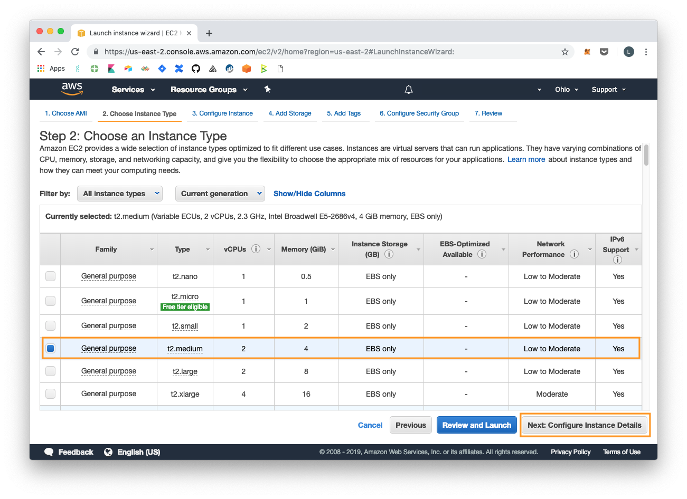

To keep things simple, we kept the default configurations.

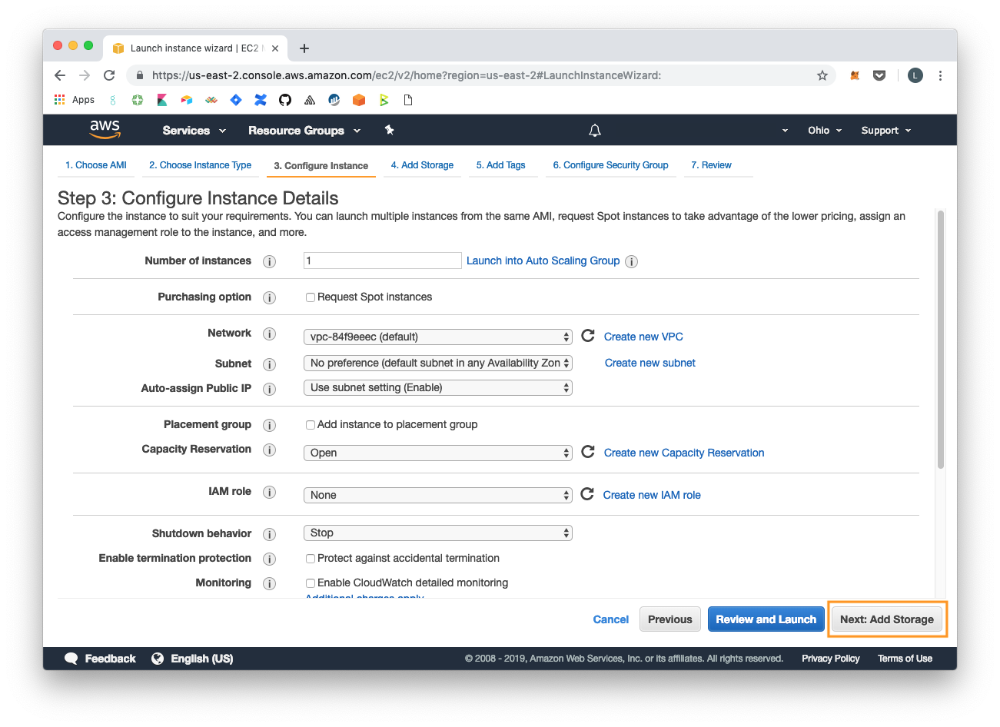

Running lightning currently requires a fully synced node. Storage size depends on the blockchain.

* For bitcoin mainnet, we recommend 250 GB of free disk space
* For bitcoin testnet, we recommend 50 GB of free disk space


To keep things simple, we kept the default tags.

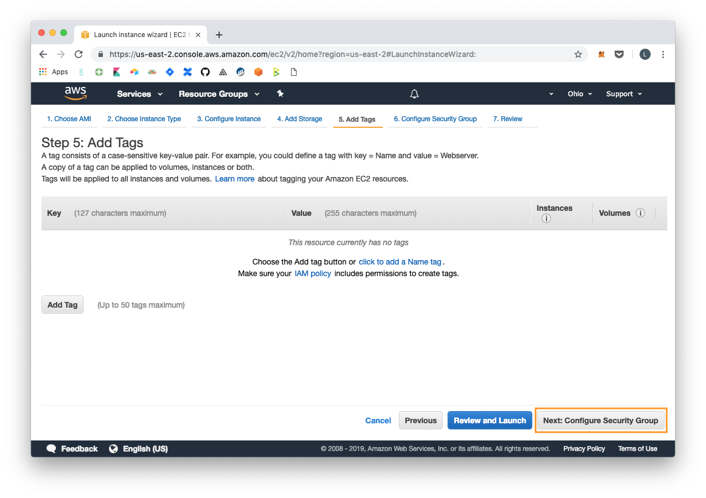

Add rules to open ports `80` and `443`. This is required to access BTCPay Server on the web.

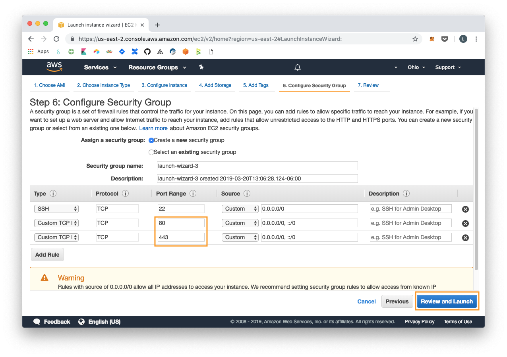

Review and launch!

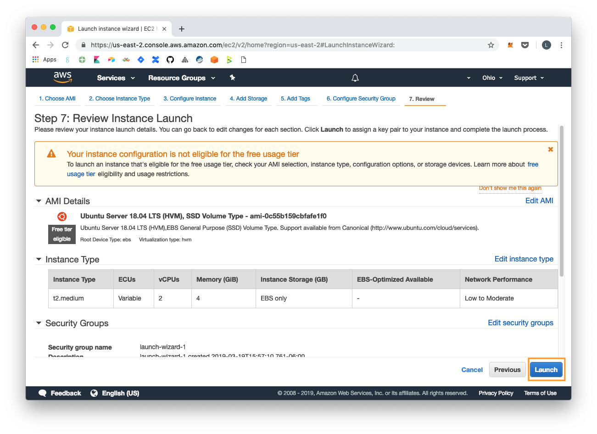

To access your instance you'll need to create a new key pair. This should allow you to connect to your instance and install BTCPay Server. Name, download and store it somewhere safe. The file should be something like `btcpay-4-aws.pem` We'll come back to this.


Once the instance is launched, you'll need to collect some information.


Get the public IP to set up DNS and install BTCPay Server.


## Set up DNS

Setting up DNS is required for BTCPay. We'll be using a service called [easyDNS](https://easydns.com/). Create an account then click `Add Domain`

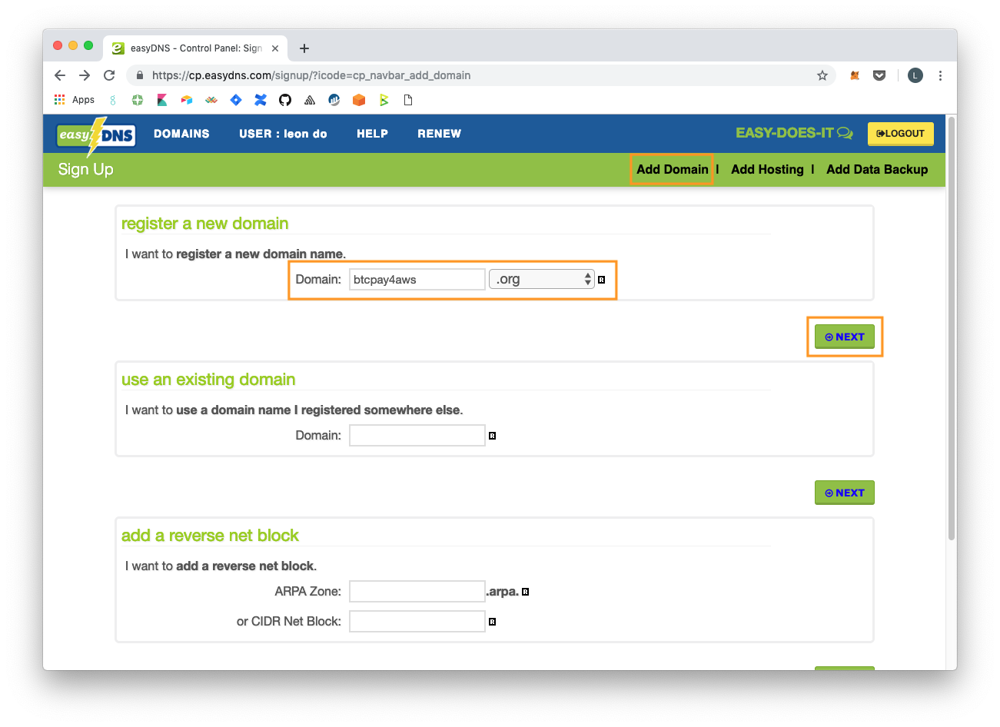

Create a domain then continue with the checkout process.


Once created, it's time to add a DNS record.


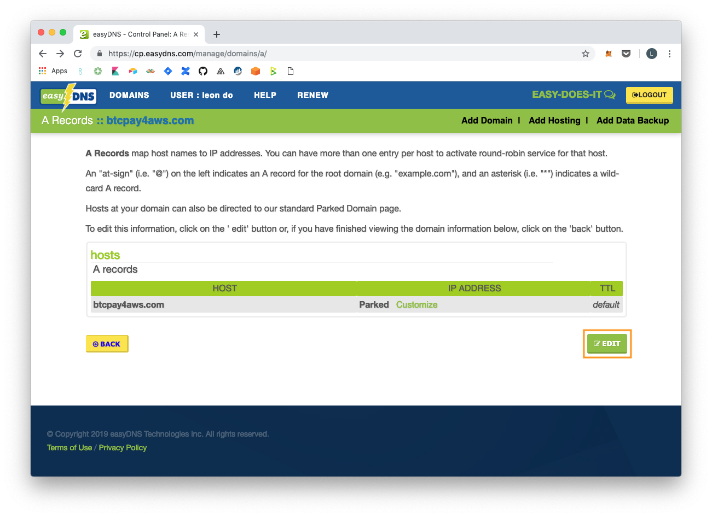

Add the public IP from AWS. In this example, we set the host to `admin`. Once everything is complete, we should be able to access the BTCPay Server at http://admin.btcpay2aws.com. 


## Install BTCPay Server

Remember the `btc-4-aws.pem` file we downloaded? This will be used to ssh in and install BTCPay Server. Open terminal and use `chmod 400` to [set the permissions](https://docs.aws.amazon.com/AWSEC2/latest/UserGuide/AccessingInstancesLinux.html) of your private key file so that only you can read it.

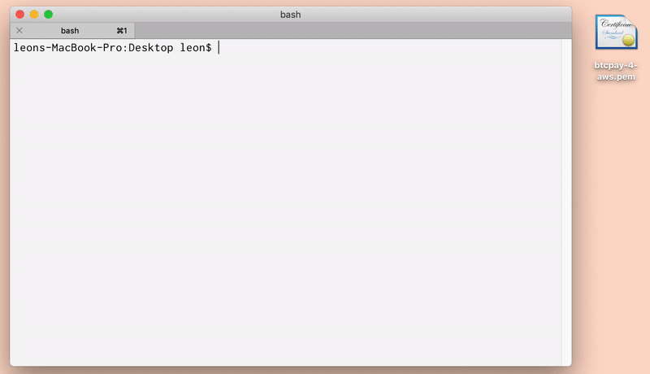

ssh into the instance with the command:

`ssh -i <path/to/your/file.pem> ubuntu@<your-public-ip>`


Once logged in, type some [commands](https://github.com/btcpayserver/btcpayserver-docker#full-installation-for-technical-users) to install BTCPay Server.

```text
# Login as root
sudo su -

# Clone this repository
git clone https://github.com/btcpayserver/btcpayserver-docker
cd btcpayserver-docker

# Run btcpay-setup.sh with the right parameters
export BTCPAY_HOST="admin.btcpay4aws.com"
export NBITCOIN_NETWORK="mainnet"
export BTCPAYGEN_CRYPTO1="btc"
export BTCPAYGEN_REVERSEPROXY="nginx"
export BTCPAYGEN_LIGHTNING="clightning"
. ./btcpay-setup.sh -i

exit
```

Make sure to change `BTC_HOST="admin.btcpay4aws.com` to the name you created . To change from c-lightning to lnd, simply change `export BTCPAYGEN_LIGHTNING="clightning"` to `export BTCPAYGEN_LIGHTNING="lnd"`

Both [clightning](https://github.com/btcpayserver/btcpayserver-doc/blob/master/LightningNetwork.md#getting-started-with-btcpay-and-c-lightning) and [lnd](https://github.com/btcpayserver/btcpayserver-doc/blob/master/LightningNetwork.md#getting-started-with-btcpay-and-lnd) have their slightly different features. For example, use lnd to connect to a [zap wallet](https://wiki.ion.radar.tech/~/edit/drafts/-LaNE4NKJT06bTxyFWW4/tutorials/wallets/zap-desktop) while c-lightning has more Lapp integration.

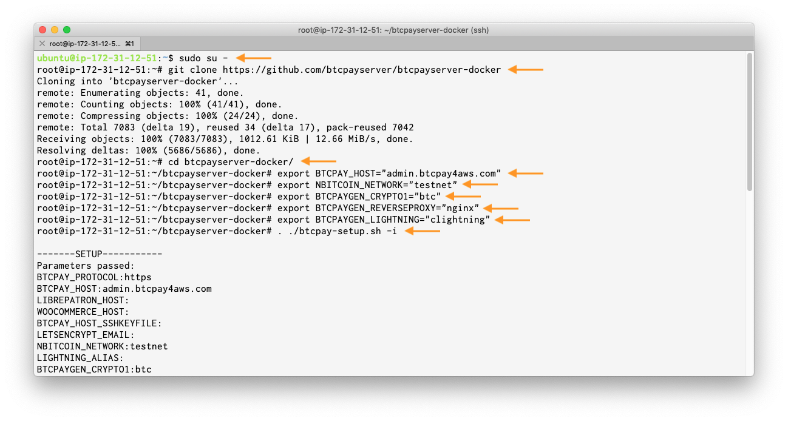

Once everything is installed, go to your browser and enter you DNS name. Click `REGISTER` to create an account.


Notice nodes are syncing. Accessing a lighting wallet currently requires a fully synced node so be patient!

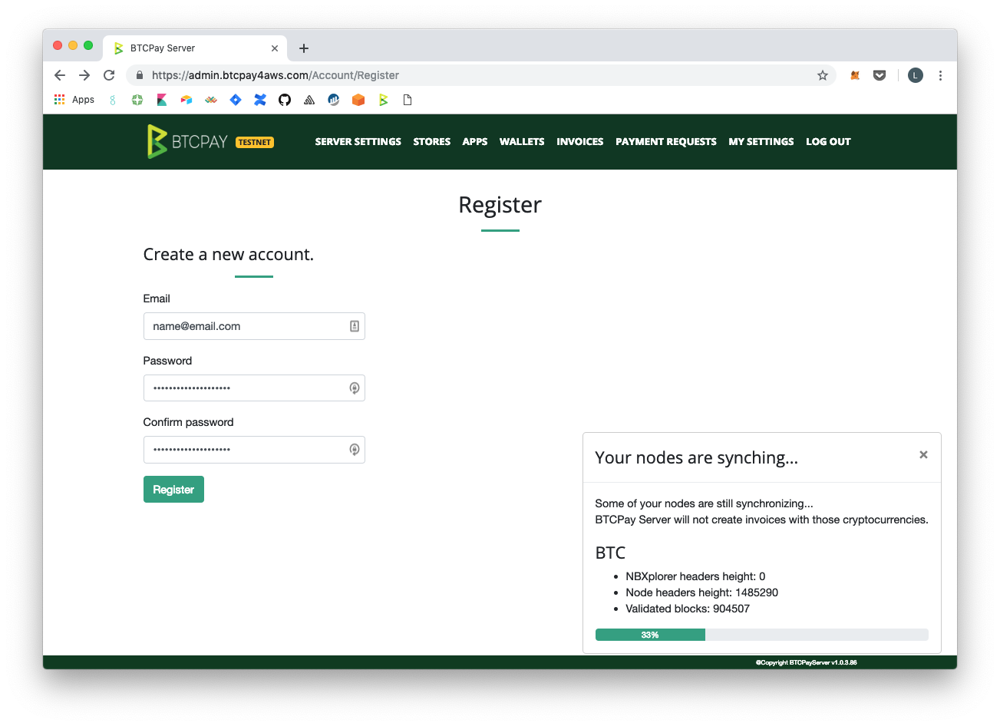

Once synced, start exploring the different features! This includes setting up a lighting [wallet](https://github.com/btcpayserver/btcpayserver-doc/blob/master/LightningNetwork.md), running a [lightning store](https://github.com/btcpayserver/btcpayserver-doc/blob/master/WooCommerce.md), or receive micropayments for [news and blogs](https://www.youtube.com/watch?v=ZbM3jcxau0o).

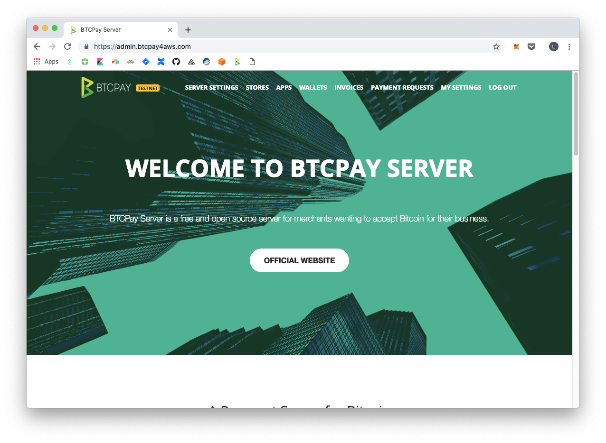

