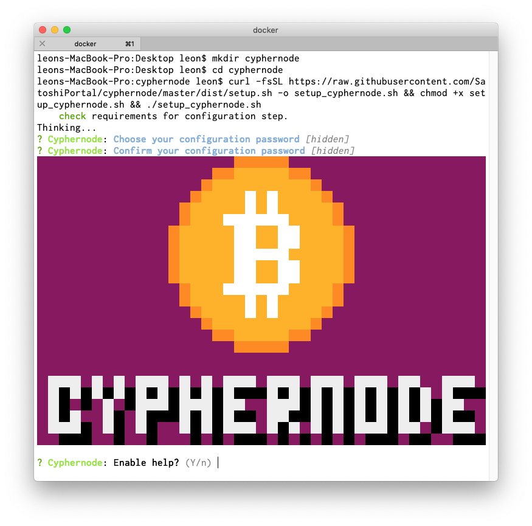

# Cyphernode

## Overview

Cyphernode is a modular Bitcoin full-node microservices API server architecture and utilities toolkit to build scalable, secure and featureful apps and services without trusted third parties.

Note: The project is in heavy development - [they](http://cyphernode.io) are currently looking for reviews, new features, user feedback and contributors to their roadmap.

## Setup

#### System requirements:

* 250 GB of storage
* 2GB of RAM.
* Docker

#### Installation instructions can also be found [here](https://github.com/SatoshiPortal/cyphernode/blob/master/doc/INSTALL.md):

Create a directory called cyphernode

`$ mkdir cyphernode && cd cyphernode`

Use the quick install

```text
$ curl -fsSL https://raw.githubusercontent.com/SatoshiPortal/cyphernode/master/dist/setup.sh -o setup_cyphernode.sh && chmod +x setup_cyphernode.sh && ./setup_cyphernode.sh
```



Follow the configuration process. Below is an example:

```text
? Cyphernode: Enable help? Yes
? Cyphernode: What features do you want to add to your cyphernode?

What optional features do you want me to activate?

 Lightning node
? Cyphernode: What net do you want to run on?

Which Bitcoin network do you want Cyphernode to run on?

 Testnet
? Cyphernode: Run as different user?

I recommend running Cyphernode as a different user when possible. Using your
current user would give Cyphernode your current access rights, which could be a
security issue especially if you are a sudoer. Please note that this feature is
not supported on OSX at runtime, but you will be fine activating it in case you
want to use the configuration file on another machine.

 No
? Cyphernode: Use a default xpub key to watch or generate adresses?

Cyphernode can derive Bitcoin addresses from an xPub and the derivation path you
want. If you want, you can provide your xPub and derivation path right now and
call 'derive' with only the index instead of having to pass your xPub and
derivation path on each call.

 No
? Gatekeeper: Enter a password to protect your client keys with

The Gatekeeper checks all the incoming requests for the right permissions before
delegating them to the proxy. Following the JWT standard, it uses HMAC signature
verification to allow or deny access. Signatures are created and verified using
secret keys. I am going to generate the secret keys and keep them in an encrypted
file. You will be able to download this encrypted file later. Please provide the
encryption passphrase.

 [hidden]
? Gatekeeper: Confirm your client keys password.


 [hidden]
? Gatekeeper: Gatekeeper cert CNS (ips, domains, wildcard domains seperated by com
ma)?

I use domain names and/or IP addresses to create valid TLS certificates. For
example, if https://cyphernodehost/getbestblockhash and
https://192.168.7.44/getbestblockhash will be used, enter cyphernodehost,
192.168.7.44 as a possible domains. 127.0.0.1, localhost, gatekeeper will be
automatically added to your list. Make sure the provided domain names are in your
DNS or client's hosts file and is reachable.

 localhost
? Gatekeeper: Edit API properties?

If you know what you are doing, it is possible to manually edit the API
endpoints/groups authorization. (Not recommended)

 No
? Bitcoin: Where is your bitcoin full node running?

Cyphernode can spawn a new Bitcoin Core full node for its own use. But if you
already have a Bitcoin Core node running, Cyphernode can use that.

 Nowhere! I want cyphernode to run one.
? Bitcoin: Name of bitcoin rpc user?

Bitcoin Core's RPC username used by Cyphernode when calling the node.

 bitcoin
? Bitcoin: Password of bitcoin rpc user?

Bitcoin Core's RPC password used by Cyphernode when calling the node.

 [hidden]
? Bitcoin: Run bitcoin node in prune mode?

If you don't have at least 350GB of disk space, you should run Bitcoin Core in
prune mode. NOTE: when running Bitcoin Core in prune mode, the incoming
transactions' fees cannot be computed by Cyphernode and won't be part of the
addresses watching's callbacks payload.

 No
? Bitcoin: Any UA comment?

User Agent string used by Bitcoin Core. (Optional)


? Lightning: What name has your lightning node?

LN nodes have names. Choose the name you want for yours.

 myLnNode
? Lightning: What color has your lightning node?

LN nodes have colors. Choose the color you want for yours in RGB format (RRGGBB).
For example, pure red would be ff0000.


? Installer: Where do you want to install cyphernode?

Only one installation mode is supported, right now: local docker (self-hosted).
Choose wisely ;-)

 Docker
? Installer: Where do you want to store your gatekeeper data?

The Gatekeeper's files (TLS certs, HMAC keys, Groups/API) will be stored in a
container's mounted directory. Please provide the local mounted path to that
directory. If running on OSX, check mountable directories in Docker's File Sharing

configs.

 /Users/leon/Desktop/cyphernode/cyphernode/gatekeeper
? Installer: Where do you want to store your proxy data?

The Cyphernode proxy container, which routes all the requests to the right
services uses a sqlite3 database to keep track of some things. This DB will be
mounted from a local path, easy to back up from outside Docker. If running on OSX,

check mountable directories in Docker's File Sharing configs.

 /Users/leon/Desktop/cyphernode/cyphernode/proxy
? Installer: Where do you want to store your bitcoin full node data?

Path name to where Bitcoin Core's data files (blockchain data, wallets, configs,
etc.) are stored. This directory will be mounted into the Bitcoin node's
container. If you already have a sync'ed node, you can copy data there to be used
by the node, instead of resyncing everything. NOTE: only copy chainstate/ and
blocks/ contents. If running on OSX, check mountable directories in Docker's File
Sharing configs.

 /Users/leon/Desktop/cyphernode/cyphernode/bitcoin
? Installer: Where do you want to store your lightning node data?

Path name to where LN's data files are stored. This directory will be mounted into

the LN node's container. If running on OSX, check mountable directories in
Docker's File Sharing configs.

 /Users/leon/Desktop/cyphernode/cyphernode/lightning
? Installer: Expose bitcoin full node outside of the docker network?

By default, Bitcoin node ports (RPC and protocol) won't be published outside of
Docker. Do you want to expose them so that your node can be accessed from outside
of the Docker network?

 Yes
? Installer: Expose lightning node outside of the docker network?

By default, LN node port will be published outside of Docker. Do you want to hide
it so that your node can't be accessed from outside of the Docker network?

 No
? Installer: What docker mode: docker swarm or docker-compose?

Cyphernode Docker services can be run using Docker Swarm
(https://docs.docker.com/engine/swarm/) or docker-compose
(https://docs.docker.com/compose/overview/). Both will work, some users prefer one

to another depending on deployment types, scalability, current framework, etc.

 docker-compose
? Installer: Cleanup installer after installation?

Do you want to remove this configurator Docker image after installation? This
would free about 150MB of disk space.

 Yes
```


Starting the containers

`$ ./start.sh`


Once everything is finished, you'll see:

```text
Depending on your current location and DNS settings, point your favorite browser to one of the following URLs to access Cyphernode's status page:

https://localhost/status/
https://127.0.0.1/status/
https://localhost/status/
https://gatekeeper/status/

Use 'admin' as the username with the configuration password you selected at the beginning of the configuration process.
```

Go to your browser and enter the url. If this is deployed on the cloud, then make sure port 443 is open.


Download `API ID's and keys`. Use an [unzipping tool](https://theunarchiver.com/) to unzip `client.7z` which contains `cacert.pem` and `keys.txt`


The `keys.txt` has the id and keys. Each label has roles assigned. 001 has the least permissions while 003 is admin.

```text
001=9c7d3e23d5d720f1d75db9142fbe2f5e38347b6b44025d0f564f9bc15372d7b2
002=27720fb1993a410c3ecd295d3599ff0a721435704fd700c6d095a9b30be0fb49
003=ef7bf0c0ce5a68aafdf07210a58c74a7f1cf85e697451bcaa07f4b5bc868426a
```

## Testing

[Manually](https://github.com/SatoshiPortal/cyphernode/blob/master/doc/INSTALL.md#manually-test-your-installation-through-the-gatekeeper) test your installation through the Gatekeeper:

Replace `k="2df1eeea3..."` with the key from `keys.txt`

```text
$ id="001";h64=$(echo -n "{\"alg\":\"HS256\",\"typ\":\"JWT\"}" | base64);p64=$(echo -n "{\"id\":\"$id\",\"exp\":$((`date +"%s"`+10))}" | base64);k="2df1eeea370eacdc5cf7e96c2d82140d1568079a5d4d87006ec8718a98883b36";s=$(echo -n "$h64.$p64" | openssl dgst -hmac "$k" -sha256 -r | cut -sd ' ' -f1);token="$h64.$p64.$s";curl -v -H "Authorization: Bearer $token" -k https://127.0.0.1/v0/getbestblockhash

{"result":"000000004c5d9ac49571b1772b48600113fe24f9c158416c9db5239792cec1a6","error":null,"id":null}
```

## Development

Cyphernode has a list of [endpoints](https://github.com/SatoshiPortal/cyphernode/blob/master/doc/API.md). There's a [go](https://github.com/schulterklopfer/cyphernode_welcome/blob/dev/cnAuth/cnAuth.go) and [javascript](https://github.com/SatoshiPortal/cyphernode/blob/dev/clients/javascript/cyphernode-client.js) implementation. Below will help you get started:

```javascript
const CryptoJS = require("crypto-js");
const request = require('request')

// allow self signed certificates
process.env["NODE_TLS_REJECT_UNAUTHORIZED"] = 0;

// from keys.txt
const api = {
  id: '002',
  key: '27720fb1993a410c3ecd295d3599ff0a721435704fd700c6d095a9b30be0fb49'
}

// echo -n "{\"alg\":\"HS256\",\"typ\":\"JWT\"}" | base64
const h64 = 'eyJhbGciOiJIUzI1NiIsInR5cCI6IkpXVCJ9Cg=='

// set expiration time
const exp = Math.round(new Date().getTime()/1000) + 10

// create message
const p = {
  exp,
  id: api.id
}
const p64 = Buffer.from(JSON.stringify(p)).toString('base64')
const msg = h64 + '.' + p64

// hash message + key to create token 
const s = CryptoJS.HmacSHA256(msg, api.key).toString()
const token = msg + '.' + s

// use token to request data
request({
  method: 'GET',
  url: 'https://127.0.0.1/v0/getnewaddress',
  headers: {
    Authorization: `Bearer ${token}`
  },
}, (err, res, body) => {
  // {"address":"2N3e4VzKqrEkwmdJ51ETeyuxpzt9bqMHyRB"}
  console.log(body)
})

```

### Future

Note that cyphernode is currently in development. Version 0.2.0 will be  out soon.

